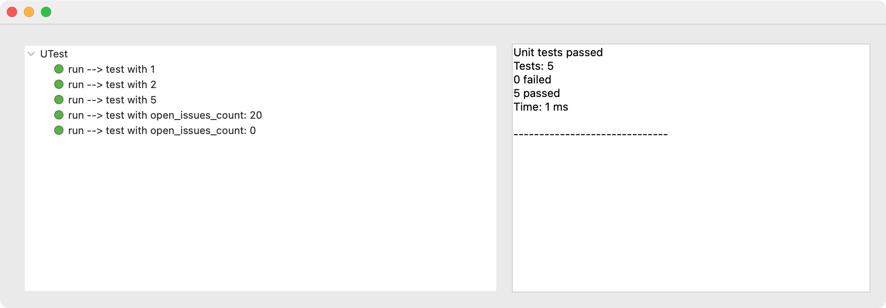

# UTest

`UTest` is a class to conduct unit tests on classes. 

For each class to test, create a testing class that references the class as the System Under Test (`sut`). For example, the constructor of the testing class for `cs.Util` would look like this:

```4d
Class constructor

This.sut:=cs.Util.new()
```

Each member function of the testing class should have the following 3 properties: `describe` `expect` `toBe`. For example, the function to test `cs.Util.fact()` would look like this:

```4d
Function fact()

	$result:=This.sut.fact(1)
	This.UTest\
	.describe("test with 1")\
	.expect($result)\
	.toBe(1)
```

Optionally, you may use the `.createMock()` member function to create a mock object. For example, the function to test `cs.Util.isRedFlag()`, which internally uses the returned object of an HTTP request, might look like this:

```4d
Function isRedFlag()

	$GitHub:=This.UTest\
	.createMock("getRepo"; {open_issues_count: 20})
	
	This.sut.GitHub:=$GitHub
	
	$result:=This.sut.isRedFlag()
	This.UTest.describe("test with open_issues_count: 20")\
	.expect($result)\
	.toBe(True)
```

## .resultText() 

**.resultText**() : Text

The unit tests results.

## .run() 

**.run**() : cs.UTest

Run unit tests.

You can specify the classes by passing a filtered collection. Omitting the collection has the same effect as the code below:

```4d
var $UTest : cs.UTest.UTest
$UTest:=cs.UTest.UTest.new()
$UTest.run(OB Entries(cs))
```

**Note**: `DataStore`, `DataClass`, `Entity`, `EntitySelection` classes are always excluded.

## .show() 

**.show**() : cs.UTest

Show unit tests results in a dialog form.


